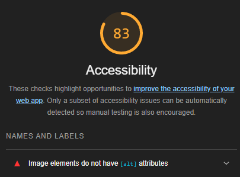

# Odd Duck Products: A Class 201d98 Lab

## Lab11, Lab12, Lab 13, Lab 15b

This application is a website that is designed to intake input and make them into votes for specific products displayed and when the maximum votes per set have been reached (default: 25) it will display a graph showing the results from the votes and will stop intaking any input until it is refreshed & set to take another set of votes. All votes are saved in Local Storage and will be carried over between refreshes, allowing you to aggregate many sets of votes and see working totals. Products shown can not be shown more than one individual product type at a time and will not repeat any of the same products from the previous vote.

### Lighthouse Scores

Lighthouse for Lab 13 and 15 (no change in score)

Lighthouse for Lab 12

